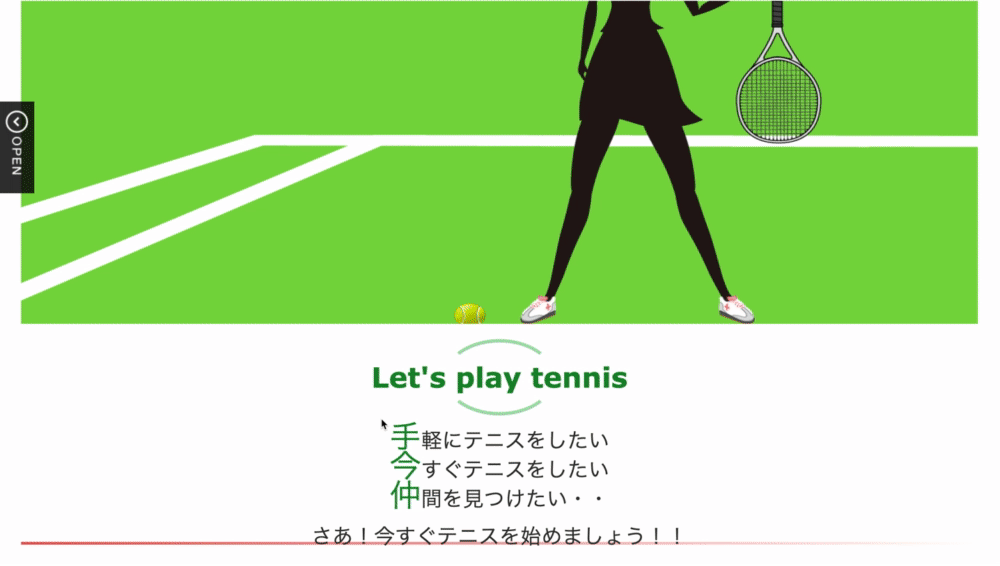
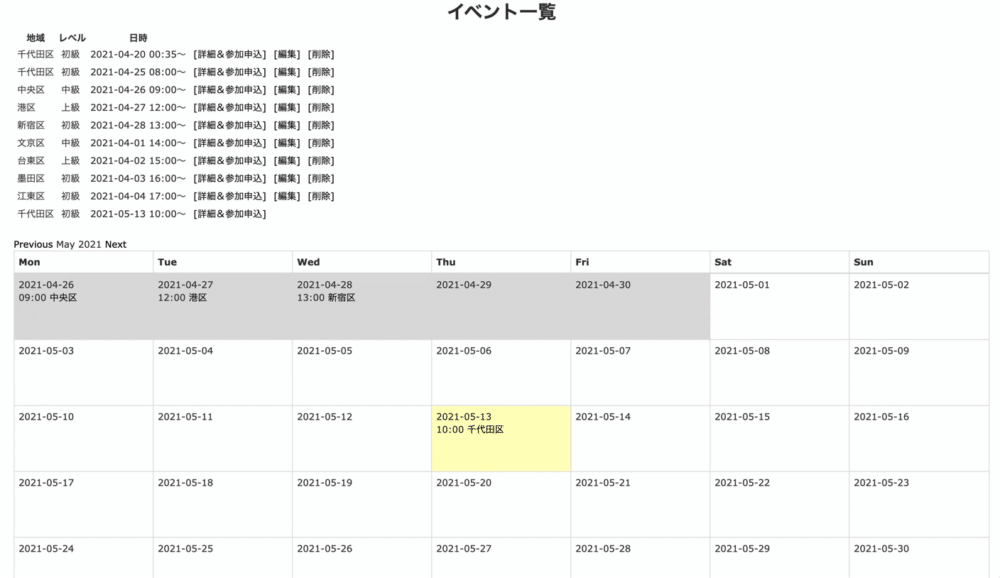
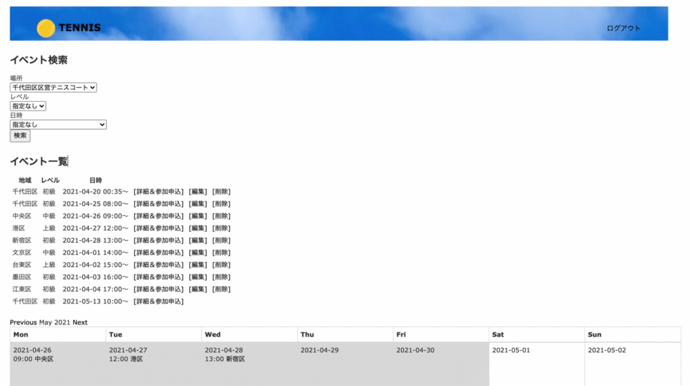

# Tennis

もっと気軽にテニスを楽しみたい人のためのアプリです

## 概要
### イベントに参加する
カレンダーページの「イベント検索」または「イベント一覧」で都合のいい日時・場所のイベントを探すことができます。[詳細＆参加申込]ボタンをクリックし、一言記入して[参加する]ボタンをクリックすると参加することができます。  

### イベント登録する
ユーザー自身が予約した区営のテニスコートなどの予約を、イベント登録ページで登録して、練習仲間を募集することができます。

## 本番環境
https://tennis-32399.herokuapp.com/ 
※ゲストログイン機能を実装したので、お気軽にご覧ください。

## テストアカウント
Email:test@test
パスワード：mako00

## 制作背景
私と同じように気軽にテニスをしたいと思っている人がたくさんいるのではと思い、このアプリを制作しました。 
「学生の頃はクラブやサークルに所属してテニスをしていたが、社会人になってからは時間の融通が利かないので、気軽にテニスができなくなってしまった」 
「有料のテニススクールに入会するとお金がかかるし、そんな本格的にはやりたくない」 
「社会人サークルに入っても予定が合わない。自分がテニスしたい時間や場所と中々合わない。テニスが目的ではなく交流が目的のところも多い・・・」 
などテニスをしたいけど色々面倒だから諦めている人はたくさんいると思います。ユーザー登録と参加方法はシンプルで簡単、1回だけの参加もOKなので、もっとたくさんの人に気軽にテニスを楽しんでもらいたいです。 

## 詳細説明

### 機能一覧
イベント一覧機能 
イベント参加機能 
イベント登録機能 
イベント削除機能 
イベント検索機能 
コメント機能 
ユーザー登録/ログイン機能  

### トップページ

トップページの動画です。「open」をクリックするとボタンが3つ表示されます。テニスボールのボタンをクリックすると、このアプリの使い方が表示されます。真ん中のテニスコートのボタンをクリックすると、イベントに参加できます。下のテニスラケットのボタンを押すとイベントを登録することができます。

### イベント参加機能

イベント一覧の[詳細&参加申込]ボタン、またはカレンダーの地域を選択するとイベントの詳細が表示され、一言記入し「参加する」ボタンを押すと参加することができます。

### イベント登録機能

トップページのラケットボタン、またはカレンダー下の[イベント登録]ボタンをクリックすると、イベント登録ページに遷移します。ユーザーが自分で区営テニスコートなどを予約し、イベント登録ページでレベル・地域・集合場所・時間・人数などを入力すると、イベントを登録し、一緒に練習する仲間を募集することができます。

### イベント検索機能

場所、レベル、日時を選んでイベントを検索することができます。

### コメント機能

イベント詳細&参加申込ページでコメントを送ることができ、アプリ内でユーザー同士がコミュニケーションできます。

## 工夫したポイント
様々な人に利用してもらうために、操作が簡単でシンプルな作りにしました。 
トップページのテニスボールのボタンを押すとアプリの使い方が書いてあるので、誰でもすぐアプリを利用できます。 
イベントに参加する手順は非常にシンプルで2つだけです。「新規登録」して「参加する」ボタンをクリックするだけで、とても簡単にイベントに参加できます。 
イベントはカレンダーと検索の両方から探すことができます。 

## 使用技術(開発環境)
ruby 2.6.5 
Rails 6.0.3.6
HTML/CSS 
Javascript/jQuery

## 課題や今後実装したい機能

### 地図機能
テニスコートの地図を表示する機能を追加したいです。 
外部API(Google Map API)、jQueryのプラグインを使用して実装したいと考えています。 

### 通知機能
急にイベントが中止になった場合に通知する機能を追加したいです。

### テストコード
テストコードの記載がまだなので、単体テストを実装する予定です。

## DB設計

### users テーブル

| Column             | Type   | Options   |
| ------------------ | ------ | --------- |
| nickname           | string |           |
| email              | string |           |
| encrypted_password | string |           |

#### Association

- has_many :comments
- has_many :participants
- has_many :reservations
  

### participants テーブル

| Column         | Type     | Options   |
| -------------- | -------- | --------- |
| text           | text     |           |
| reservation_id | integer  |           |
| user_id        | integer  |           |

#### Association

- belongs_to :reservation
- belongs_to :user

###  reservationsテーブル

| Column     | Type       | Options   |
| ---------- | ---------- | --------- |
| area       | text       |           |
| start_time | datetime   |           |
| end_time   | datetime   |           |
| level      | string     |           |
| user_id    | integer    |           |
| city_id    | integer    |           |
| min        | integer    |           |
| max        | integer    |           |
| text       | text       |           |

#### Association

- has_many :participants
- belongs_to :city
- belongs_to :user
- has_many :comments
  

### comments テーブル

| Column         | Type       | Options |
| -------------- | ---------- | ------- |
| text           | text       |         |
| user_id        | integer    |         |
| reservation_id | integer    |         |

#### Association

- belongs_to :reservation
- belongs_to :user